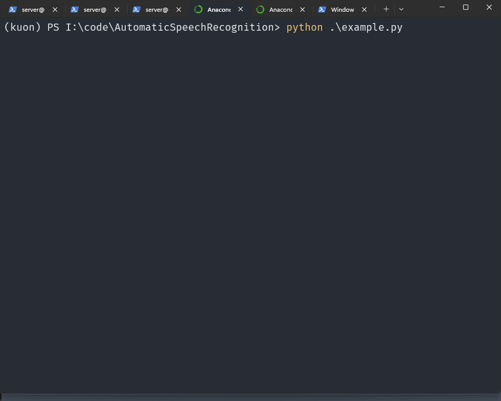
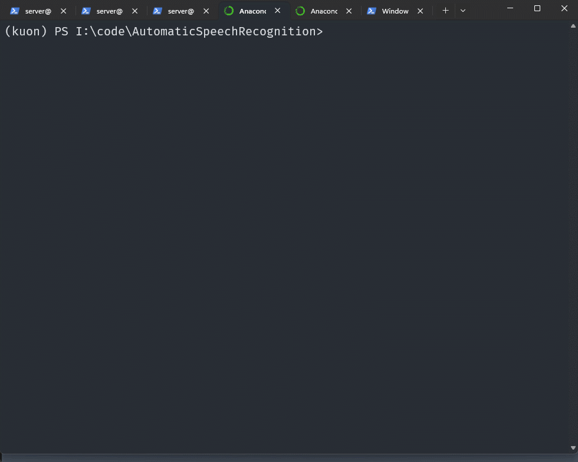
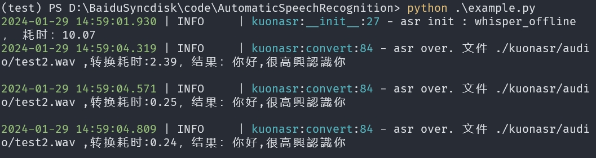

## kunasr
该仓库用于语音识别，目前有三种实现方式，分别是paraformer、whisper_online、funasr、whisper_offline。主要用于服务[kuon](https://github.com/lissettecarlr/kuon)仓库。

## 依赖

可以直接`pip install -r requirements.txt`安装所有环境，也可以根据选择方式安装

### paraformer

* onnxruntime-gpu 或者 onnxruntime
* numpy
* librosa 用于音频分析和处理
* pyyaml
* typeguard==2.13.3
* scipy

### whisper_online

* openai
* langid

### funasr_client

* websockets

### whisper_offline

* torch
* faster-whisper

## 配置
```bash
cp config.yaml.example config.yaml
```
* channel 从paraformer、whisper_online、funasr、whisper_offline中选择一种
* 如果选择whisper_online，则需要配置openai的key和代理地址
* 如果选择funasr，则需要配置funasr的服务端地址
* 如果选择whisper_offline，模型选择：tiny、base、medium、small、large-v2、large-v3、tiny.en、base.en、medium.en、small.en，device选择：cpu、cuda

## 使用

*如果使用funasr，则需要部署服务端，这里推荐使用该方式*

```python
from kuonasr import ASR
test = ASR()
test.test()
```

```python
from kuonasr import ASR
asr = ASR()
try:
    result = asr.convert("./kuonasr/audio/asr_example.wav")
    print(result)
except Exception as e:
    print(e)
```

可以直接执行`python .\example.py`进行测试。

使用paraformer时：


使用whisper_online时：


使用funasr时：


使用whisper_offline时：



## 关于转换方式

### paraformer

源码来自rapid的[RapidASR仓库](https://github.com/RapidAI/RapidASR/blob/main/README.md)

[模型百度云](https://pan.baidu.com/s/1sY6ENdKcxM-X7bqK07RThg?pwd=kuon)，在paraformer文件夹下的名为asr_paraformerv2的文件，将其放置到kuonasr/paraformer/models文件中。或者去原项目下载。

### whisper_online

openai的whisper在线语音识别，[官方文档](https://platform.openai.com/docs/guides/speech-to-text)。实际上就是调用接口而已。
使用时注意将openai升级到最新版本，改动了调用方式。然后需要配置密匙和代理地址。准确率还行，但是速度太慢了。

### funasr

[github仓库](https://github.com/alibaba-damo-academy/FunASR)，需要先部署服务端，这里代码只是客户端进行接口的调用。部署方式可以看官方仓库，也可以参考[笔记](https://blog.kala.love/posts/cbe699d7/)。目前该方式是最优解

### whisper_offline

使用[faster-whisper](https://github.com/SYSTRAN/faster-whisper)进行本地推理

## 报错：

### 1
```bash
ValueError: An error occurred: unknown format: 3
```
输入音频的格式不支持，可以使用sox进行转换，例如
```bash
sox test.wav -b 16 -e signed-integer test2.wav
```
* [sox的github](https://github.com/chirlu/sox)
