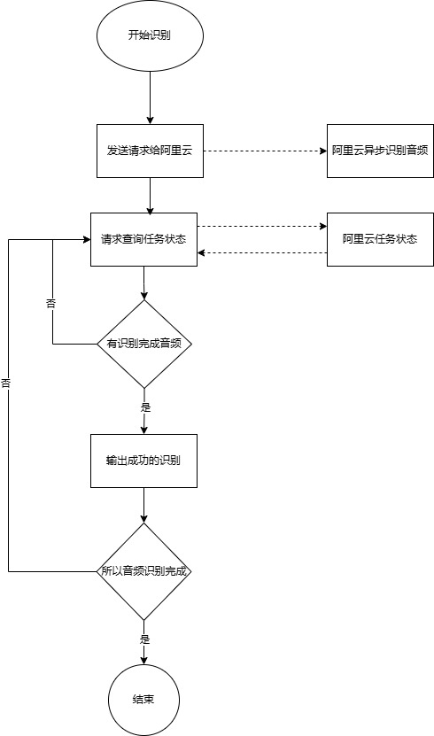

# Paraformer语音识别

对接阿里云百炼的Paraformer模型。

* [模型广场-Paraformer-v2模型](https://bailian.console.aliyun.com/#/model-market/detail/paraformer-v2)
* [API文档](https://help.aliyun.com/zh/isi/developer-reference/api-details)


## 使用

这里只是对此API进行了封装，使其易于使用。首先从阿里云请求响应逻辑谈起。

首先通过async_call提交一个识别任务，由于是异步的，所以会立即返回一个task_id，然后通过task_id来获取识别结果。

```python
task_response = dashscope.audio.asr.Transcription.async_call(
    model='paraformer-v2',
    language_hints=['zh', 'en'],
    vocabulary_id='vocab-Xxxx',
    speaker_count=1,
    diarization_enabled=True,
    file_urls=[
        'https://dashscope.oss-cn-beijing.aliyuncs.com/samples/audio/sensevoice/rich_text_example_1.wav',
    ])
```
参数说明（跟多见[文档](https://help.aliyun.com/zh/model-studio/developer-reference/paraformer-api/?spm=a2c4g.11186623.0.0.2f89695bdcF1jt#b73b0c4423oa1)）：
* model: 模型名称：
    * paraformer-v2 ：支持任意采样率，支持中文（包含中文普通话和各种方言）、英文、日语、韩语。支持热词功能
    * paraformer-8k-v2
    * paraformer-v1
    * paraformer-8k-v1
    * paraformer-mtl-v1
* language_hints：仅对paraformer-v2生效，支持：zh、en、ja、ko、yue
* vocabulary_id：热词id，使用见[定制热词](https://help.aliyun.com/zh/model-studio/developer-reference/custom-hot-words?spm=a2c4g.11186623.0.0.653d601bP8tTed)


响应：
```json
{
    "status_code": 200,
    "request_id": "8c59f00c-7723-455e-922d-ac3a31838170",
    "code": "",
    "message": "",
    "output": {
        "task_id": "bd725f8f-f699-4962-bcad-38a9fc2bcd7c",
        "task_status": "PENDING"
    },
    "usage": null
}
```

接下来就需要不断去请求来查询任务状态，直到任务完成。这里阿里提供了两种方式：

* dashscope.audio.asr.Transcribe.wait()
    以阻塞的方式等待异步任务结束（即到达SUCCEEDED或FAILED状态），返回任务的状态和文件转写结果

* dashscope.audio.asr.Transcribe.fetch()
    查询异步任务，返回任务的状态和文件转写结果

这里是示例的返回：
```json
{
    "status_code": 200,
    "request_id": "548c1e4b-1383-4a48-b747-ff46382ffd9d",
    "code": null,
    "message": "",
    "output": {
        "task_id": "bd725f8f-f699-4962-bcad-38a9fc2bcd7c",
        "task_status": "SUCCEEDED",
        "results": [
            {
                "file_url": "https://dashscope.oss-cn-beijing.aliyuncs.com/samples/audio/paraformer/hello_world_male.wav",
                "transcription_url": "https://dashscope-result-bj.oss-cn-beijing.aliyuncs.com/0cbf0acf/20230517/14%3A30/4545b696-08f6-4330-825e-c1a0c3f67eaf-1.json?Expires=1684391431&OSSAccessKeyId=LTAI***************4G8qL&Signature=1z8zxHVQqdmUKgxr2ldipyC6lOU%3D",
                "subtask_status": "SUCCEEDED"
            },
            {
                "file_url": "https://dashscope.oss-cn-beijing.aliyuncs.com/samples/audio/paraformer/hello_world_female.wav",
                "transcription_url": "https://dashscope-result-bj.oss-cn-beijing.aliyuncs.com/0cbf0acf/20230517/14%3A30/9e5c4e54-3612-47c3-a824-5eeeea3059ee-1.json?Expires=1684391431&OSSAccessKeyId=LTAI***************4G8qL&Signature=WlzLbAk0zaCVJ5SkATd6xNcEQQ0%3D",
                "subtask_status": "SUCCEEDED"
            }
        ]
    },
    "usage": {
        "duration": 8
    }
}
```

我的流式实际上就是使用fetch，不断的查询状态，哪个结果SUCCEEDED或者FAILED，就先抛出这个结果，继续查询，直到所以任务结束。流程图如下：




